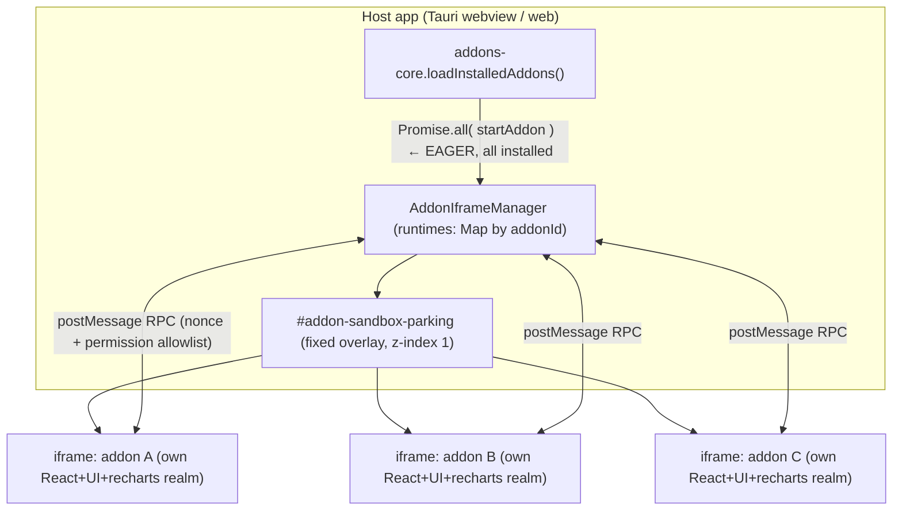
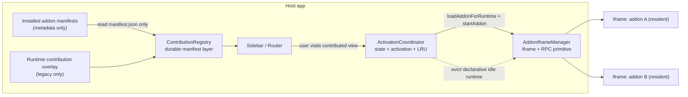

# RFC: Addon Runtime Lifecycle — Lazy Activation, Eviction, and Declarative Contributions

- **Status:** Draft / Proposed
- **Author:** (fill in)
- **Created:** 2026-07-06
- **Revised:** 2026-07-07 — incorporated review findings: old-host manifest
  compatibility, `minWealthfolioVersion` enforcement, dev-mode/hot-reload
  registry behavior, lifecycle ownership, phase re-sequencing (dep slimming
  promoted, eviction instrumentation-gated)
- **Affects:** `apps/frontend/src/addons/**`, `packages/addon-sdk/**`, addon
  authors
- **Related:** [addon-architecture.md](./addon-architecture.md),
  [shared-query-client-design.md](./shared-query-client-design.md),
  [addon-migration-guide-v3.5-to-v3.6.md](./addon-migration-guide-v3.5-to-v3.6.md)

## 1. Summary

Every enabled addon today (installed addons are enabled by default) runs in its
own sandboxed iframe that is **booted eagerly at app startup** and **kept
resident for the whole session**. Each iframe is an isolated JS realm that
instantiates the **entire host frontend stack** (React, ReactDOM,
`@wealthfolio/ui`, `recharts`, `lucide-react`, `@tanstack/react-query`,
`date-fns`). Cost therefore scales **linearly with the number of enabled addons,
with a large per-addon constant**, regardless of whether the user ever opens
them.

This RFC proposes keeping the **iframe isolation boundary** (it is sound) while
modernizing the **lifecycle and contribution model** to match how VS Code,
Figma, and Chrome MV3 handle third-party extensions. The recommended
architecture is a **manifest-first addon shell with lazy iframe runtimes**:

1. **Manifest-backed ContributionRegistry** — addons declare static views in
   `manifest.json`; the host builds a validated navigation/route registry from
   manifest metadata **without executing addon code**.
2. **ActivationCoordinator** — a host-owned lifecycle layer loads addon code on
   first use, deduplicates concurrent activation, tracks resident runtimes, and
   enforces eviction policy.
3. **Low-level AddonIframeManager** — keep the existing sandboxed iframe + RPC
   manager focused on creating, attaching, routing, and stopping already
   activated runtimes.
4. **Dependency slimming** — make heavy host deps (`recharts`, icon sets) lazily
   importable so every resident realm's baseline is smaller. Requires no addon
   migration, no schema change, and no two-code-path window.
5. **Idle eviction (LRU) — instrumentation-gated** — cap resident iframes for
   migrated/declarative addons; evict least-recently-used and re-boot on demand.
   Ship only if telemetry shows resident-set pressure after lazy activation +
   slimming.

Net effect: resident realms drop from **O(enabled)** to **O(recently-used)** —
in practice O(visited-this-session) — and startup stops paying for addons the
user never opens.

## 2. Motivation

### 2.1 Current architecture (as built)



Key facts, grounded in the code:

- **Eager boot.** `loadInstalledAddons()` discovers **all** installed addons,
  filters to enabled ones (`enabled !== false`, the default —
  [`:177`](../../apps/frontend/src/addons/addons-core.ts#L177)), and starts them
  with `Promise.all(...)` at app load —
  [`addons-core.ts:162`](../../apps/frontend/src/addons/addons-core.ts#L162),
  [`:196`](../../apps/frontend/src/addons/addons-core.ts#L196). There is no
  "start on first use."
- **One resident iframe per addon.** `startAddon` creates an
  `<iframe sandbox="allow-scripts">` (opaque origin, `credentialless`), appends
  it to `#addon-sandbox-parking`, and stores it in a `runtimes` map keyed by
  `addonId` —
  [`addon-iframe-manager.ts:339`](../../apps/frontend/src/addons/iframe/addon-iframe-manager.ts#L339).
  Navigation only **shows/hides/repositions** the frame
  (`attachRoute`/`updateFrameBounds`/`hideFrame`); it never creates or destroys
  per view.
- **Full stack per realm.** Each sandbox loads `addon-sandbox-entry.tsx`, which
  pulls in `host-dependencies.ts` — React, ReactDOM, `@wealthfolio/ui`,
  `recharts`, `lucide-react`, `@tanstack/react-query`, `date-fns`, the full SDK
  —
  [`host-dependencies.ts:1`](../../apps/frontend/src/addons/iframe/host-dependencies.ts#L1).
  The browser caches the source bytes, but **each iframe realm instantiates its
  own copies** (separate React instance, component defs, chart lib).
- **Nav requires execution.** Sidebar items and routes are registered **at
  runtime** by the running addon via `sidebar.addItem` / `router.add` →
  `registerAddonNavItem` / `registerAddonRoute`. The manifest carries `main`,
  `icon`, and permissions but **no declarative navigation** — so the host must
  boot the addon just to learn it contributes a sidebar entry.
- **Isolation & RPC (the good part).** Cross-origin iframe + `sandbox` + CSP; a
  nonce'd `postMessage` channel (`wealthfolio:addon-sandbox:v1`) with
  `event.source` verification, an `ALLOWED_API_METHODS` allowlist, and a
  per-addon permission guard.

### 2.2 The cost

| Dimension        | Current behavior                                                                                                                                                                  | Scaling                                                      |
| ---------------- | --------------------------------------------------------------------------------------------------------------------------------------------------------------------------------- | ------------------------------------------------------------ |
| **Memory**       | Each addon holds a full React + UI + recharts + icon realm resident for the session                                                                                               | **O(enabled)**, est. tens of MB per addon (Phase 0 measures) |
| **Startup**      | Every enabled addon boots in parallel at launch (each with a 10s load timeout)                                                                                                    | CPU/parse spike **O(enabled)**                               |
| **Steady state** | Each addon keeps its realm (React instance, module graph) plus any event subscriptions; the route-attached addon also holds a ResizeObserver; `broadcastTheme` loops all runtimes | **O(enabled)**                                               |
| **User value**   | Paid whether or not the addon is ever opened                                                                                                                                      | —                                                            |

For today's marketplace (a handful of addons, a few enabled) this is acceptable
and buys instant, state-preserving switches. It does **not** scale to dozens of
installed addons — the scenario this RFC targets.

### 2.3 Non-problem: the isolation boundary

The per-addon sandboxed iframe is the **correct** primitive for untrusted
third-party UI on the web, and this RFC does **not** change it. See §4 (Prior
art) — Figma and Shopify use the same boundary. The problem is purely **when**
we boot and **how much** each boot costs, not **how** we isolate.

## 3. Goals / Non-goals

### Goals

- G1. Resident realms scale with **usage**, not with **install count**.
- G2. Rendering navigation (sidebar items, routes) must **not** require
  executing the addon.
- G3. Idle/rarely-used addons must be **evictable** and cheaply re-bootable.
- G4. Preserve the current security model (iframe isolation, permission
  allowlist, RPC) unchanged.
- G5. Backward compatibility: existing addons keep working through a deprecation
  window.

### Non-goals

- N1. Changing the isolation primitive (no move to processes/workers for UI).
- N2. Sharing a rendering realm across untrusted addons (breaks isolation).
- N3. Cross-addon state sharing.
- N4. Redesigning the host-API surface or permission categories.

## 4. Prior art

| System                  | Isolation primitive                                                                                | Logic vs UI                                                      | Lifecycle                                                    | Contributions                                     |
| ----------------------- | -------------------------------------------------------------------------------------------------- | ---------------------------------------------------------------- | ------------------------------------------------------------ | ------------------------------------------------- |
| **VS Code**             | One shared Extension Host **process** (Node) for all extensions; per-webview iframes for custom UI | **Split** — logic in shared host (no DOM); UI mostly declarative | **Lazy** via _activation events_; idle extensions never boot | **Declarative** (`contributes` in `package.json`) |
| **Figma**               | Locked-down JS realm for plugin logic (no DOM) + separate `showUI` iframe                          | **Split** — logic realm ↔ UI iframe over postMessage             | **On-invocation**; torn down after                           | Manifest-declared commands/menus                  |
| **Chrome MV3**          | Ephemeral background **service worker** + content scripts + on-demand popup docs                   | **Split**                                                        | **Event-driven, evictable** — SW killed when idle            | Declarative (`manifest.json`)                     |
| **Shopify**             | Per-app iframe (App Bridge)                                                                        | Fused in iframe                                                  | On-navigation                                                | Declarative app config                            |
| **Obsidian**            | **None** — runs in the Electron renderer with full access                                          | Fused, full DOM                                                  | On-enable                                                    | Runtime registration                              |
| **Wealthfolio (today)** | **Per-addon sandboxed iframe**                                                                     | **Fused** — logic + UI in one realm, full stack each             | **Eager, all-resident**                                      | **Runtime** (`sidebar.addItem`)                   |

**Takeaways.** Wealthfolio's isolation matches Figma/Shopify and is stronger
than Obsidian. The scalable systems win on two moves we don't make: (1)
**declarative contributions** so the shell renders nav without running plugins,
and (2) **lazy/evictable lifecycle** so the always-on cost is near zero. VS Code
additionally keeps the always-on part (logic) in a **single shared host** and
defers UI to webviews only when shown — the deepest version of the split.

## 5. Proposed design

### 5.1 Target architecture



The key architectural split:

- `manifest.json` remains the **source of truth** for static addon
  contributions.
- `ContributionRegistry` is **not the manifest**. It is a host-owned in-memory
  index derived from installed manifests: normalized, validated, sorted, and
  ready for the host sidebar/router.
- The registry has two layers during migration:
  - **Durable manifest layer** — static views/routes from `contributes`;
    survives iframe stop/eviction; cleared only on disable, uninstall, or
    manifest update.
  - **Transient runtime overlay** — old `sidebar.addItem` / `router.add`
    registrations from already-running legacy addons; cleared when the runtime
    stops.
- The transient overlay does **not** mean the host must run all addons to build
  the registry. New/migrated addons derive nav from manifest metadata only. Only
  legacy addons without `contributes` need the old eager runtime path.

### 5.2 Declarative contributions (manifest)

Add an optional `contributes` block to the manifest so static navigation is
data, not code. First cut should prefer one simple `views` contribution instead
of separate `sidebar` and `routes` blocks:

```jsonc
{
  "id": "dividend-tracker-addon",
  "main": "dist/addon.js",
  "contributes": {
    "views": [
      {
        "id": "dividend-tracker",
        "label": "Dividends Importer",
        "icon": "hand-deposit",
        "path": "/addons/dividend-tracker",
        "order": 160,
      },
    ],
  },
  "activationEvents": ["onView:dividend-tracker"],
}
```

- A contributed `view` means: one sidebar/search/launcher entry and one host
  route that renders an `AddonIframeRoute` for that `addonId + viewId`.
- The host builds sidebar items and routes from `contributes` **at startup,
  install, enable, or update time**, reading only the manifest (G2).
- `sidebar.addItem` / `router.add` remain supported for genuinely **dynamic**
  items an addon computes at runtime, but static nav should migrate to
  `contributes.views`.
- `activationEvents` (borrowed from VS Code) declare when to boot:
  `onView:<id>`, `onStartup` (rare, for background addons), later `onCommand`,
  `onEvent:portfolio.onUpdateComplete`, etc. Absent/empty ⇒ activate on first
  route visit (default).
- Advanced route contributions can be added later if real addons need multiple
  routes behind one sidebar item. Do not add that complexity in the first cut
  unless an existing addon requires it.

#### Manifest ingestion reality (hard prerequisite)

`contributes` does not survive today's install pipeline. The Rust backend parses
manifests by **manually copying known fields** out of the raw JSON
(`parse_manifest_json_metadata` —
[`service.rs:843`](../../crates/core/src/addons/service.rs#L843)) and then
**rewrites `manifest.json` from the typed struct** on install (`write_manifest`
— [`service.rs:1810`](../../crates/core/src/addons/service.rs#L1810)). Any
unknown field — including `contributes` and `activationEvents` — is silently
stripped before the frontend ever sees it. Therefore:

- Phase 1 must add the new fields to the Rust model **and** the manual parser,
  with install/update round-trip tests asserting they survive re-serialization.
- On hosts older than Phase 1, `contributes` is silently deleted at install
  time. An addon that migrates to manifest-only nav and drops its runtime
  `sidebar.addItem` calls would have **no navigation at all** on old hosts.
- Mitigation: during the deprecation window, migrated addons must either keep
  runtime registration as a fallback (the host ignores runtime registrations
  that duplicate a durable contribution for the same view) or declare a
  `minWealthfolioVersion` excluding pre-`contributes` hosts.
- `minWealthfolioVersion` is currently **not enforced** — compatibility checking
  only warns on `sdkVersion` mismatch
  ([`addons-core.ts:66`](../../apps/frontend/src/addons/addons-core.ts#L66)).
  Phase 1 must add enforcement (block install/enable with a clear error) for
  that fallback to be meaningful.

### 5.3 ContributionRegistry responsibilities

The registry should replace the current single-purpose runtime maps with a
durable manifest layer plus a transient runtime layer. It should:

- Register enabled installed addon manifests without calling
  `loadAddonForRuntime`, importing addon JS, or creating an iframe.
- Validate manifest paths with the same route-namespace policy that protects
  runtime route registration today.
- Reject external URLs, empty ids/labels, duplicate view ids, invalid paths, and
  route namespaces owned by another installed addon.
- Expose one combined list for navigation and one combined list for host routes:
  durable manifest contributions plus any transient runtime overlay.
- Preserve manifest contributions when an iframe is stopped or evicted.
- Clear transient runtime contributions on runtime stop.
- Clear durable manifest contributions only when the addon is disabled,
  uninstalled, or its manifest changes.
- Provide lookup helpers such as `getView(addonId, viewId)` and
  `getAddonForPath(path)` so activation does not need to inspect addon code.

Declarative `contributes.views` should not require the runtime
`ui.sidebar.addItem` or `ui.router.add` permission because no host API is
invoked. The install/review surface should still display contributed views, and
runtime UI APIs should keep their current permission guard.

**Registry resync ownership.** The registry needs one named owner for lifecycle
events. Today, settings actions funnel every change through a whole-world
`reloadAllAddons()` — update
([`use-addon-actions.ts:202`](../../apps/frontend/src/pages/settings/addons/hooks/use-addon-actions.ts#L202)),
install
([`:238`](../../apps/frontend/src/pages/settings/addons/hooks/use-addon-actions.ts#L238)),
toggle
([`:268`](../../apps/frontend/src/pages/settings/addons/hooks/use-addon-actions.ts#L268)),
and uninstall
([`:297`](../../apps/frontend/src/pages/settings/addons/hooks/use-addon-actions.ts#L297)).
`ActivationCoordinator` owns resync: it handles **install, update, enable,
disable, uninstall, and dev reload** by re-ingesting only the affected addon's
manifest into the durable layer and stopping/starting only that addon's runtime.
Whole-world reload remains as a recovery path, not the routine one.

### 5.4 ActivationCoordinator

Add a host-owned `ActivationCoordinator` above `AddonIframeManager`. This layer
should own lifecycle policy, not iframe mechanics:

- Runtime states: `registered`, `activating`, `active`, `evicted`, `failed`,
  `disabled`.
- Installed manifest/cache data needed to call `loadAddonForRuntime(addonId)` on
  demand.
- In-flight activation promises so double-clicks, direct URL loads, and route
  re-renders do not create duplicate iframes.
- Resident runtime handles and last-used timestamps for LRU.
- Pinning policy for legacy runtime-only addons and `onStartup`/background
  addons.
- Retry and optional prefetch-on-hover behavior.

`AddonIframeRoute` should activate through this coordinator before attaching the
iframe:

```text
route mounts
  -> ContributionRegistry resolves addonId + viewId
  -> ActivationCoordinator.activateView(addonId, viewId)
  -> loadAddonForRuntime(addonId)
  -> AddonIframeManager.startAddon(...)
  -> AddonIframeManager.attachRoute/updateRoute(...)
```

Do **not** put addon discovery or activation policy inside `attachRoute` or
`updateRoute`. Those methods currently assume a runtime exists and throw when it
does not; the better boundary is to keep `AddonIframeManager` as a low-level
runtime primitive and let the coordinator decide when a runtime should exist.

Startup work becomes: read installed manifests → populate `ContributionRegistry`
→ render host nav/router. No iframe is created for migrated addons until an
activation event fires. (G1)

### 5.5 Idle eviction (LRU) — instrumentation-gated

- **Gate on data.** Ship eviction only if Phase 0/Phase 3 telemetry shows the
  resident set actually exceeding the cap in real sessions. After lazy
  activation, resident ≈ visited-this-session — small for most users — and
  dependency slimming (§5.7) shrinks what remains. Eviction is the insurance
  policy, not the headline fix.
- Use `ActivationCoordinator` to track last-used time per runtime and enforce a
  cap `maxResidentAddons` (config; default e.g. 4–6).
- On activation beyond the cap, `stopAddon` the least-recently-used runtime
  (already implemented — `stopRuntime` tears down the iframe, subscriptions,
  observers) and re-boot on next use.
- Only evict declarative/lazy-safe addons in the first cut. Legacy runtime-only
  addons must be pinned/non-evictable until they migrate, because stopping them
  clears their runtime-registered nav/routes.
- Eviction must clear only the transient runtime overlay. Manifest-derived
  contributions must remain visible because they live in `ContributionRegistry`,
  outside `clearAddonRegistrations`.
- Never evict an addon with an active `onStartup`/background activation or an
  in-flight route render.
- Optional later: a `serializeState`/`restoreState` SDK hook so eviction/re-boot
  can preserve UI state; until then, re-boot is a fresh render (acceptable for
  infrequently-used addons). (G3)

### 5.6 Low-level AddonIframeManager

Keep `AddonIframeManager` focused on mechanics:

- create sandboxed iframe and nonce'd RPC channel;
- send addon code/files once activated;
- attach/detach route containers;
- render route messages;
- stop runtimes and clean subscriptions/observers.

It should not know whether an addon is installed, migrated, evictable, or
activation-worthy. That policy belongs in `ActivationCoordinator`.

### 5.7 Dependency slimming

`recharts` and `lucide-react` likely dominate the per-realm baseline, but the
current `host-dependencies.ts` statically imports them up front. The existing
`createHostDependencyModuleUrl` helper creates per-specifier blob modules, but
it does **not** make those dependencies lazy if the aggregate module already
imported them.

To actually slim the baseline, change host dependency resolution so heavy
modules are imported only when an addon imports that specifier.

Expected win and limits:

- The win is bounded: React, ReactDOM, the SDK, and the core UI kit are needed
  by virtually every addon and can never be lazy; the iframe itself (separate
  document, JS heap, event loop) has a fixed cost slimming cannot touch.
- The benefit is usage-dependent: an addon that imports `recharts` at module top
  level pulls it in the moment it loads regardless. Savings accrue to addons
  that do not use the heavy modules.
- Still the best effort-to-value item after lazy activation: it shrinks every
  resident realm and requires no addon migration, no manifest schema change, and
  no two-code-path window.

This is complementary to lazy activation (§5.4); together they may remove the
need for eviction (§5.5) entirely.

### 5.8 Development mode and hot reload

Dev-server addons bypass the installed-manifest pipeline entirely: they load
before installed addons
([`addons-loader.ts:14`](../../apps/frontend/src/addons/addons-loader.ts#L14)),
boot from partial manifests served by the dev server
([`addons-dev-mode.ts:196`](../../apps/frontend/src/addons/addons-dev-mode.ts#L196)),
and hot reload tears down and restarts the runtime from a polling watcher
([`addons-dev-mode.ts:265`](../../apps/frontend/src/addons/addons-dev-mode.ts#L265)).
They also load before `setInstalledAddonIds`, so namespace reservation does not
cover them (acceptable: dev addons are trusted).

Policy:

- Dev addons are always **pinned** (eager, non-evictable): hot reload requires a
  running runtime, and dev iteration must never race lazy activation.
- If the dev manifest includes `contributes`, ingest it into the durable layer
  tagged as dev-scoped, so authors exercise the same nav path that ships. On hot
  reload, treat it as a manifest update: clear and re-ingest the dev addon's
  durable contributions before restarting the runtime.
- Dev-scoped durable contributions are cleared when the dev server disappears or
  dev mode is disabled.

## 6. Migration plan (phased, backward compatible)

| Phase                                | Change                                                                                                                                                                                                                                                           | API impact       | Ships value                                                              |
| ------------------------------------ | ---------------------------------------------------------------------------------------------------------------------------------------------------------------------------------------------------------------------------------------------------------------- | ---------------- | ------------------------------------------------------------------------ |
| **0. Instrument**                    | Add per-addon boot-time + route-render latency + resident count. Add heap sampling where available.                                                                                                                                                              | none             | Baseline data to set `maxResidentAddons`                                 |
| **1. Manifest schema + registry**    | Add `contributes.views` and `activationEvents` to the Rust model **and manual parser**, SDK types, and scaffold template, with install/update round-trip tests (§5.2). Enforce `minWealthfolioVersion`. Add `ContributionRegistry` durable layer and validation. | additive         | Fields survive install; host can know static nav without addon execution |
| **2. Host nav/router from registry** | Render sidebar/routes from `ContributionRegistry`; keep runtime `sidebar.addItem` / `router.add` as a transient overlay. Legacy addons still boot eagerly and are pinned. Coordinator owns per-addon lifecycle resync (§5.3).                                    | additive, opt-in | Safe migration path; no visible nav regressions                          |
| **3. Lazy activation**               | Add `ActivationCoordinator`; route mount activates contributed views on demand; migrated addons no longer boot at startup.                                                                                                                                       | additive         | Startup O(installed manifests), O(visited) realms                        |
| **4. Dep slimming**                  | Make heavy host deps truly lazy instead of statically importing them in the sandbox bootstrap.                                                                                                                                                                   | none (internal)  | Smaller baseline for every resident realm                                |
| **5. LRU eviction (conditional)**    | Only if telemetry from Phases 0/3 shows resident-set pressure: enforce `maxResidentAddons` for declarative/lazy-safe runtimes; keep legacy and background addons non-evictable.                                                                                  | none             | Memory ceiling without disappearing nav                                  |
| **6. Activation events**             | Expand beyond `onView` to `onStartup`, `onCommand`, and domain events; define background addon policy.                                                                                                                                                           | additive         | Fine-grained lifecycle control                                           |

Do **not** ship LRU before the durable registry split. Today `stopAddon` clears
runtime registrations; eviction before manifest-backed contributions would make
some addons disappear from navigation.

Each phase is independently shippable and reversible after Phase 1. Phase 3 is
the startup fix; Phase 4 shrinks what remains resident; Phase 5 is insurance,
bought only if the data says it is needed.

### Backward compatibility

- Addons **with** `contributes.views` use the new path: manifest-derived nav at
  startup, runtime booted lazily on first activation.
- Addons **without** `contributes` fall back to the current model: booted
  eagerly so their runtime `sidebar.addItem` / `router.add` still registers nav.
  They should be pinned/non-evictable until migrated.
- **New addons on old hosts:** hosts older than Phase 1 strip `contributes` at
  install (manual parser + typed manifest rewrite — see §5.2). During the
  deprecation window, migrated addons must keep runtime nav registration as a
  fallback or set `minWealthfolioVersion` to the first `contributes`-aware
  release. The host ignores runtime registrations that duplicate a durable
  contribution for the same view, so the fallback is harmless on new hosts.
- No breaking change to the host API, permissions, or RPC.
- Runtime `sidebar.addItem` / `router.add` remains for genuinely dynamic items,
  but static nav should warn/lint and migrate to `contributes.views`.
- Deprecate runtime-only static nav registration over one or two minor versions;
  the v3.5→v3.6 guide sets precedent for staged addon migrations.

## 7. Security considerations

- Isolation is **unchanged**: same cross-origin sandboxed iframe, CSP, nonce'd
  RPC, `ALLOWED_API_METHODS`, permission guard.
- `contributes` is **declarative data** parsed by the host; it grants no
  capability — routes/sidebar entries are UI only, and any host-API call still
  goes through the permission allowlist at invocation time.
- Manifest contributions must be validated at ingestion time. Reuse the existing
  route namespace policy: an addon may only contribute paths in its own reserved
  namespace or an unclaimed custom namespace. Reject external URLs, malformed
  paths, duplicate view ids, and namespaces owned by another installed addon.
- Manifest-derived routes must not be cleared by runtime teardown. Only disable,
  uninstall, or manifest update should remove durable contributions.
- Runtime `sidebar.addItem` and `router.add` remain guarded by the existing `ui`
  permission because they are executable host API calls.
- Lazy boot slightly **reduces** attack surface at rest (fewer running realms).
- Eviction must fully tear down subscriptions/observers (already handled in
  `stopRuntime`) to avoid leaks or ghost listeners.

## 8. Performance targets

- **Startup:** number of iframes booted at launch = number of `onStartup` addons
  plus legacy runtime-only addons (target: near 0 after migration), down from
  all installed.
- **Memory:** resident realms ≈ addons visited this session; if eviction ships
  (Phase 5), ≤ `maxResidentAddons` regardless of install count.
- **First-open latency:** activating a cold addon should reach "rendered" within
  the existing route-render budget (10s timeout; target < ~300–500 ms
  warm-path). Mitigate perceived latency with prefetch-on-hover of the sidebar
  item.

## 9. Risks & mitigations

| Risk                                                                       | Mitigation                                                                                                                                                    |
| -------------------------------------------------------------------------- | ------------------------------------------------------------------------------------------------------------------------------------------------------------- |
| First-open latency after lazy boot / eviction                              | Prefetch on sidebar hover; keep `maxResidentAddons` ≥ typical working set; show existing cold-render status                                                   |
| State loss on eviction                                                     | Start with only-evict-when-idle + high enough cap; add `serializeState` hook later                                                                            |
| Addons relying on always-running background work                           | `onStartup`/event activations keep those resident; document the cost                                                                                          |
| Declarative nav can't express dynamic items                                | Keep `sidebar.addItem` for computed items; `contributes.views` for static                                                                                     |
| Two nav code paths during migration                                        | Time-box the deprecation; lint/warn when an addon registers static nav at runtime                                                                             |
| LRU removes nav/routes for legacy addons                                   | Do not evict runtime-only legacy addons; evict only addons with durable manifest contributions                                                                |
| Manifest contribution route squatting                                      | Validate `contributes.views[].path` with the existing namespace policy before adding it to the registry                                                       |
| Activation logic leaks into low-level iframe manager                       | Keep `ActivationCoordinator` above `AddonIframeManager`; manager only handles already-activated runtimes                                                      |
| Backend/frontend manifest schema drift                                     | Update Rust models/parser, SDK types, scaffold template, store listing docs, and install/update tests together                                                |
| Migrated addon has no nav on old hosts (`contributes` stripped at install) | Keep runtime registration fallback through the deprecation window; enforce `minWealthfolioVersion` (Phase 1); store listing surfaces the minimum host version |
| Dev-mode/hot-reload bypasses the registry                                  | §5.8: dev addons pinned; dev manifest contributions ingested dev-scoped and re-ingested on hot reload                                                         |
| Registry drifts from installed state on install/toggle/uninstall           | Coordinator owns per-addon resync for all lifecycle events (§5.3); whole-world reload kept only as recovery                                                   |

## 10. Alternatives considered

- **Do nothing.** Fine at current scale; fails at dozens of addons. Rejected as
  the long-term answer.
- **Shared rendering realm for all addons.** One iframe hosting multiple addon
  "slots" — one React instance. Rejected (N2): collapses per-addon isolation; a
  buggy/malicious addon could reach siblings.
- **Move addon logic to a shared Web Worker / VS Code-style logic host, UI
  iframe only on demand.** The most powerful option and a natural Phase 5, but a
  larger API redesign (logic can't touch DOM). Deferred; §5 gets most of the
  benefit without it.
- **Process-per-addon (Tauri side).** Heavier than iframes, loses the single
  web/desktop codebase, no isolation win over sandboxed iframes for UI.
  Rejected.

## 11. Open questions

1. If eviction ships (Phase 5): default `maxResidentAddons` — fixed, or adaptive
   to device memory?
2. Should `onStartup` be allowed for community addons, or reserved/opt-in to
   prevent "always-resident" abuse?
3. Do we need a state-preservation hook in the first cut, or is fresh re-render
   acceptable initially?
4. Prefetch policy — hover, viewport, or none?
5. Migration: hard-require `contributes` at some SDK major, or support runtime
   nav indefinitely as the "dynamic" escape hatch?
6. Is `contributes.views` sufficient for v1, or does an existing addon require
   multi-route declarative contributions immediately?
7. Should install review display contributed views as a separate UI surface,
   even though they do not require runtime `ui` permission?
8. What is the pinning policy and warning surface for legacy addons that remain
   eager/non-evictable?

## Appendix A: Code references

- Eager boot:
  [`addons-core.ts` `loadInstalledAddons`](../../apps/frontend/src/addons/addons-core.ts#L162),
  `Promise.all` at [`:196`](../../apps/frontend/src/addons/addons-core.ts#L196)
- App startup hook:
  [`addon-runtime-loader.tsx`](../../apps/frontend/src/addons/addon-runtime-loader.tsx)
- Iframe lifecycle:
  [`addon-iframe-manager.ts` `startAddon`](../../apps/frontend/src/addons/iframe/addon-iframe-manager.ts#L339)
  / `stopRuntime` / `attachRoute` / `updateFrameBounds`
- Route host:
  [`addon-iframe-route.tsx`](../../apps/frontend/src/addons/iframe/addon-iframe-route.tsx)
- Per-realm host deps:
  [`host-dependencies.ts`](../../apps/frontend/src/addons/iframe/host-dependencies.ts)
- Sandbox bootstrap:
  [`addon-sandbox-entry.tsx`](../../apps/frontend/src/addons/iframe/addon-sandbox-entry.tsx),
  [`addon-sandbox.html`](../../apps/frontend/addon-sandbox.html)
- Runtime nav/route registry:
  [`addons-runtime-context.ts` `registerAddonNavItem` / `registerAddonRoute`](../../apps/frontend/src/addons/addons-runtime-context.ts)
- Manifest schema:
  [`packages/addon-sdk/src/manifest.ts`](../../packages/addon-sdk/src/manifest.ts),
  [`crates/core/src/addons/models.rs`](../../crates/core/src/addons/models.rs),
  [`crates/core/src/addons/service.rs`](../../crates/core/src/addons/service.rs)
- Manifest parsing / install rewrite:
  [`crates/core/src/addons/service.rs` `parse_manifest_json_metadata`](../../crates/core/src/addons/service.rs#L843),
  [`write_manifest`](../../crates/core/src/addons/service.rs#L1810)
- Settings lifecycle actions (whole-world reload today):
  [`use-addon-actions.ts`](../../apps/frontend/src/pages/settings/addons/hooks/use-addon-actions.ts)
- Dev mode / hot reload:
  [`addons-loader.ts`](../../apps/frontend/src/addons/addons-loader.ts),
  [`addons-dev-mode.ts`](../../apps/frontend/src/addons/addons-dev-mode.ts)
- Addon scaffold:
  [`packages/addon-dev-tools/templates/manifest.json.template`](../../packages/addon-dev-tools/templates/manifest.json.template)
- Theme snapshot (recently hardened):
  [`addon-sandbox-theme.ts`](../../apps/frontend/src/addons/iframe/addon-sandbox-theme.ts)
